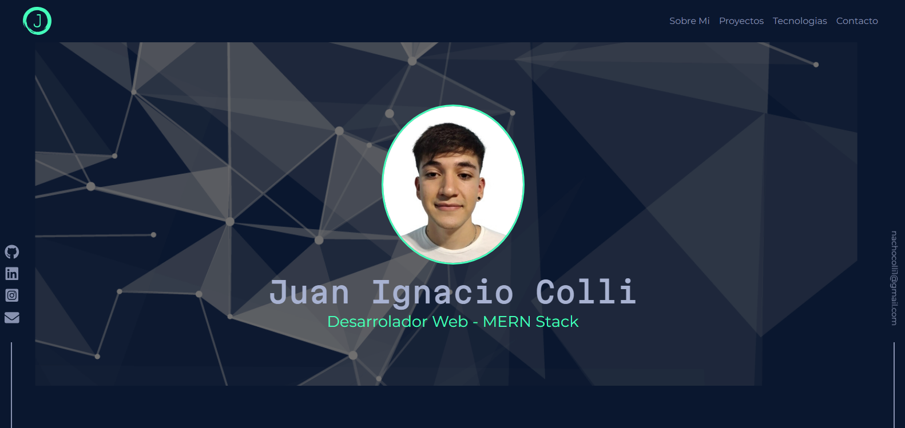
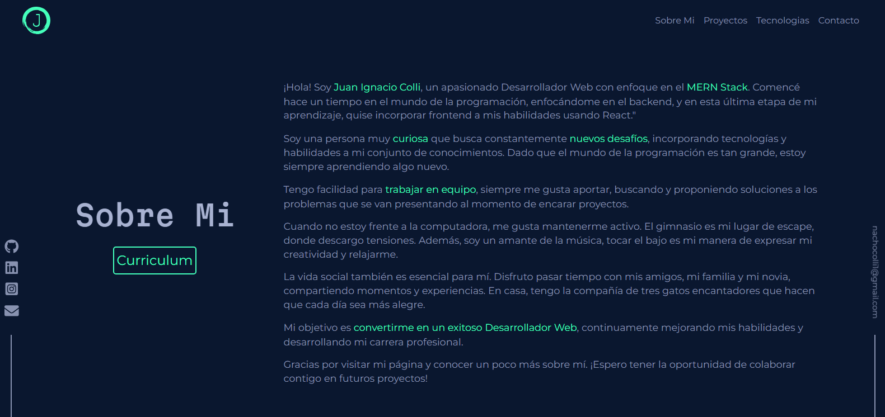
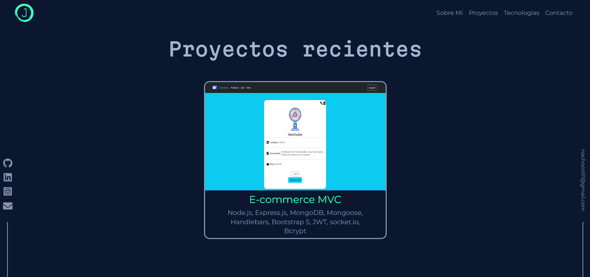
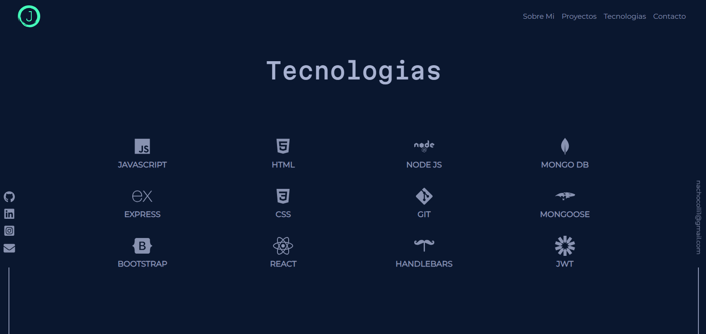
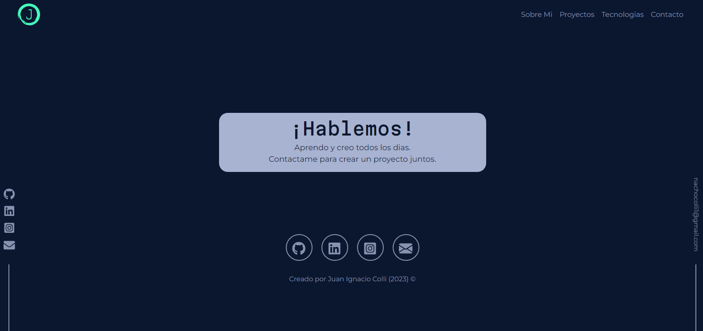

# Portfolio (Responsive)

Este es mi portfolio de desarrollador web , el cual va a ir mostrando cada uno de mis proyectos más recientes.
Posee diferentes secciones las cuales muestran cualidades mias , tecnologias que manejo y por suepuesto mi contacto.

## Tecnologías

Esta página web fue creada con:

* React.js
* CSS
* HTML
* Bootstrap 5

Además, se incluyeron **Google Fonts** para personalizar la fuente y **React-icons** para incorporar íconos como logos de redes sociales populares. 

## Deploy

Puedes acceder al proyecto desplegado en: https://boisterous-zabaione-b01b8d.netlify.app/

### Capturas de pantalla:

Seccion Hero:

Sobre Mi:

Proyectos:

Tecnologias:

Contacto:

